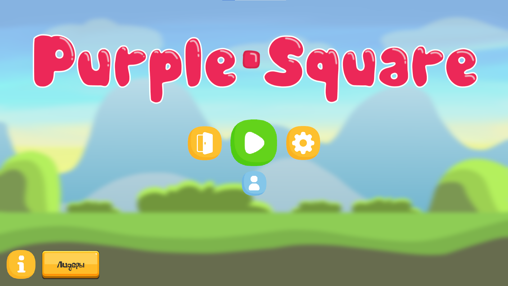
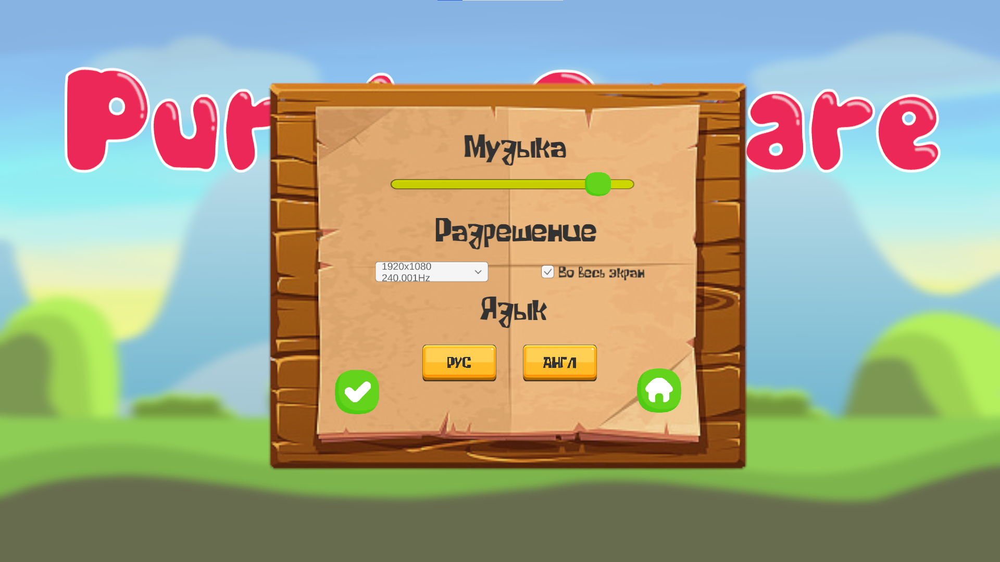
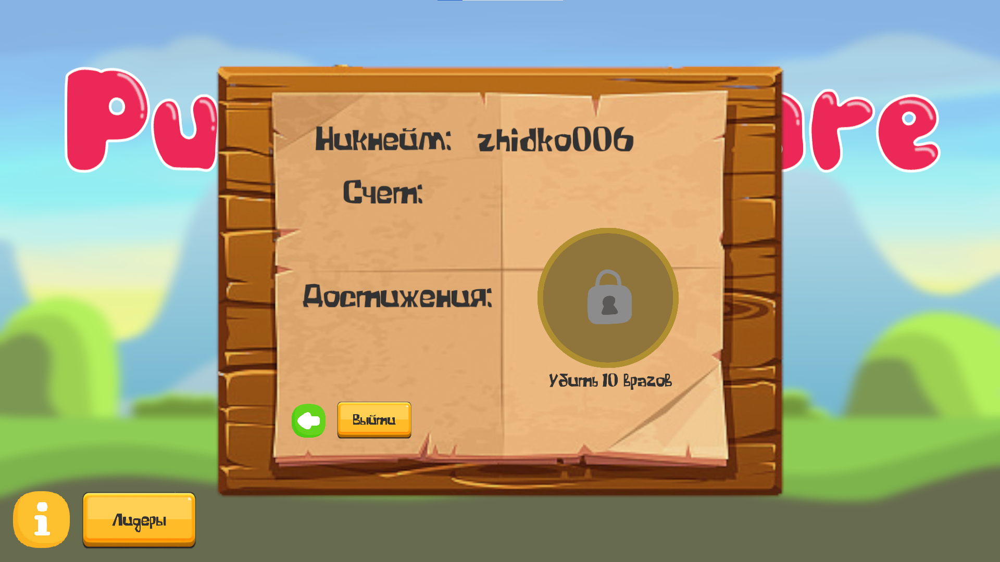
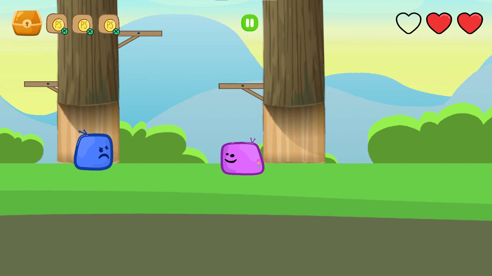
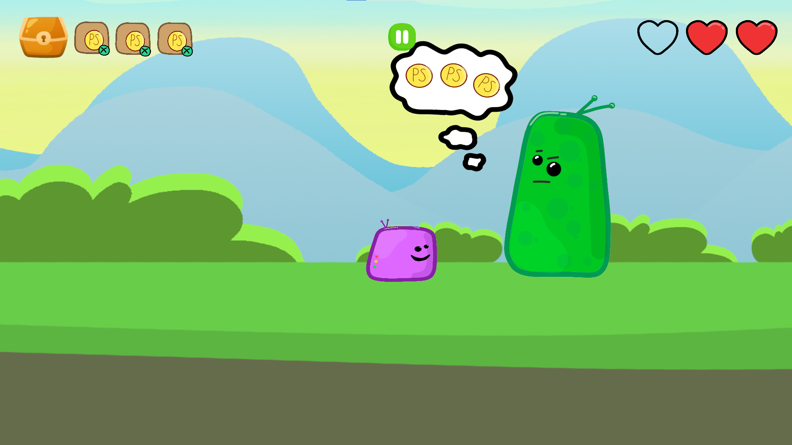
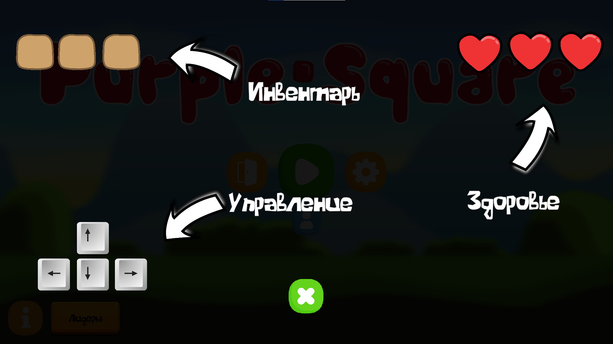

# 👾 PurpleSquare

> 2D-платформер на Unity.  
> Главная цель игрока — сражаться с врагами, выполнять квесты и взаимодействовать с предметами и NPC.  
> 90% всех текстур были нарисованы вручную!

---

## 🎮 Геймплей
- Игрок сражается с врагами и выполняет различные задания.  
- Можно подбирать предметы в инвентарь.  
- На пути встречаются NPC и противники, которые могут помешать продвижению.  

---

## ✨ Особенности
- 🔑 Авторизация и сохранение прогресса.  
- 🌍 Поддержка двух языков: EN / RU.  
- 🏆 Таблица лидеров.  
- 👤 Профиль игрока с результатами и достижениями.  

---

## 🛠️ Технологии
- **Unity (C#)**
- **SQLite (через DB Browser)** — работа с базой данных.  

---

## 📸 Скриншоты

  <table>
    <tr>
      <td align="center">
         
        <b>Главное меню</b> 
        Начало игры и переход к разделам.
      </td>
      <td align="center">
         
        <b>Настройки</b> 
        Изменение графики, разрешения и звука.
      </td>
    </tr>
    <tr>
      <td align="center">
         
        <b>Профиль игрока</b> 
        Отображение прогресса и достижений.
      </td>
      <td align="center">
         
        <b>Враги</b> 
        Препятствия и испытания на пути игрока.
      </td>
    </tr>
    <tr>
      <td align="center">
         
        <b>NPC</b> 
        Персонажи для выполнения заданий.
      </td>
      <td align="center">
         
        <b>Информационные панели</b> 
        Подсказки и важные данные для игрока.
      </td>
    </tr>
  </table>

---

## 🚀 Запуск
1. Скачайте билд игры: [Office Escape — Download](https://drive.google.com/file/d/1HNfGps5iDdF_LaS7_3uZ3w4IutIUKb4I/view?usp=sharing)  
2. Запустите `.exe` файл.

---

## 🕹️ Управление
- WASD — перемещение  
- Shift — бег  
- Q — камера  
- E — взаимодействие  
- ESC — пауза  

---

## 📌 О проекте
Игра была создана весной 2025 года как самостоятельный проект для практики в Unity и геймдизайне.  
Основной упор сделан на:
- Атмосферу напряжённости
- Простые, но интересные головоломки
- Динамику «исследование + побег»

---

## 📂 Структура билда
- `Office Escape.exe` — исполняемый файл  
- `Office Escape_Data/` — игровые ресурсы  
- `MonoBleedingEdge/` — системные библиотеки  
- `UnityCrashHandler64.exe` — обработчик ошибок  
